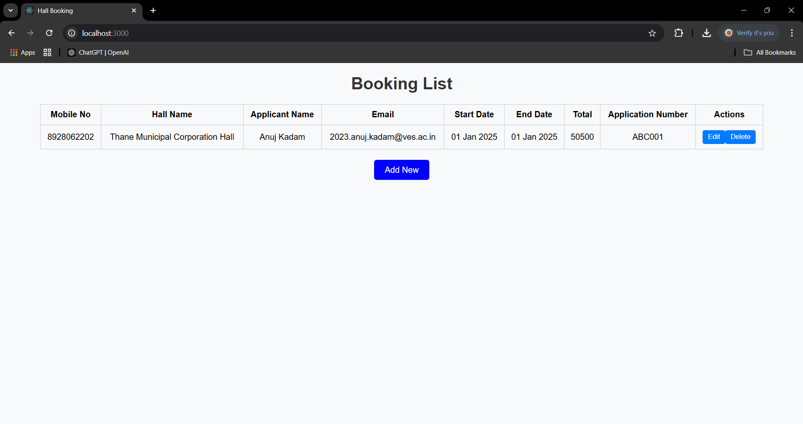

# Hall Booking System

This project is a web-based hall booking system built with the following technologies:

- **Frontend**: React
- **Backend**: Java Microservices (Spring Boot)
- **Database**: PostgreSQL

The application allows users to:
1. Submit new hall bookings.
2. View a list of existing bookings.
3. Update or delete bookings.

All database operations (e.g., `SELECT`, `INSERT`, `UPDATE`, `DELETE`) are managed through stored procedures in PostgreSQL. No sensitive credentials or server URLs are hardcoded in the source code.

## Prerequisites

Ensure you have the following installed on your system:

1. **Node.js** (v14 or later)
2. **Java JDK** (v11 or later)
3. **PostgreSQL** (v12 or later)
4. **Maven** (for building the backend)
5. **Git** (for cloning the repository)

## Project Setup

### 1. Clone the Repository

```bash
$ git clone <repository-url>
$ cd hall-booking-system
```

### 2. Database Setup

1. Install PostgreSQL and create a database:
   ```sql
   CREATE DATABASE hall_booking;
   ```

2. Execute the SQL script provided in `database/schema.sql` to create the required tables and stored procedures.

3. Update the database connection details in the `application.properties` file located in the backend's `src/main/resources` directory:
   ```properties
   spring.datasource.url=jdbc:postgresql://<host>:<port>/hall_booking
   spring.datasource.username=<your-username>
   spring.datasource.password=<your-password>
   ```

### 3. Backend Setup

1. Navigate to the backend directory:
   ```bash
   $ cd backend
   ```

2. Build the backend using Maven:
   ```bash
   $ mvn clean install
   ```

3. Run the Spring Boot application:
   ```bash
   $ mvn spring-boot:run
   ```

The backend server will start on `http://localhost:8080` by default.

### 4. Frontend Setup

1. Navigate to the frontend directory:
   ```bash
   $ cd frontend
   ```

2. Install the dependencies:
   ```bash
   $ npm install
   ```

3. Start the React development server:
   ```bash
   $ npm start
   ```

The frontend application will start on `http://localhost:3000` by default.

### 5. Configuration Management

- Use a `.env` file in the frontend directory to configure the API base URL:
  ```env
  REACT_APP_API_BASE_URL=http://localhost:8080
  ```

- Ensure the `application.properties` file in the backend is correctly configured to connect to the PostgreSQL database.

## Usage

1. Open the frontend application in your browser (`http://localhost:3000`).
2. Use the form to submit a new booking.
3. View, update, or delete bookings from the booking list.

## Screenshots

### Booking Form
)

### Booking Form Page 2
)

### Booking List with Update & Delete options


## Deployment

For production deployment:

1. Build the React frontend:
   ```bash
   $ npm run build
   ```
   The build files will be located in the `frontend/build` directory.

2. Deploy the backend as a standalone JAR or WAR file on a production server.

3. Configure the backend to serve the React build files as static assets.

## Troubleshooting

- **Database connection issues**: Verify the PostgreSQL server is running and the connection details are correct in `application.properties`.
- **Backend not starting**: Check the logs for missing dependencies or configuration errors.
- **Frontend not loading**: Ensure the React development server is running and the API base URL is correctly set in `.env`.

## License

This project is licensed under the MIT License.
